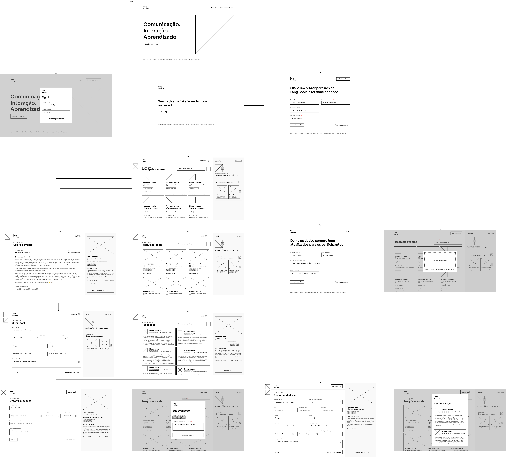

# Projeto de Interface

Visão geral da interação do usuário pelas telas do sistema e protótipo interativo das telas com as funcionalidades que fazem parte do sistema (wireframes).

## Diagrama de Fluxo

# Wireframes

## Landing page
A Landing page, é uma tela de boas vindas que permite o usuário acessar a função de cadastro ou login.

## Cadastro
Na tela de realizar cadastro é possível preencher os campos: Nome de usuário, Email do usuário, Digitar senha, Repetir senha e então, os dados poderão ser salvos e também é possível retornar ao início. 

## Sucesso
A tela de sucesso permite o usuário visualizar o sucesso da ação cadastro e a partir disso, acessar a função login.

## Login
Na tela de realizar login é possível preencher os campos de email do usuário e senha do usuário para acessar a plataforma.

## Home Page
A tela de Home Page permite que o usuário visualize os principais eventos que estão acontecendo na cidade em que está localizado, realizar a busca de outros eventos e acessar seu própio perfil de usuário.

## Atualizar dados do usuário
Na tela de atualizar dados do usuário é possível preencher do usuário para que seus dados sejam atualizados. Além disso, é possível preencher uma descrição de usuário e marcar ou desmacar a opção de tornar público o contato do usuário em questão.

## Atualizar foto do perfil
A tela de atualizar foto de perfil permite que o usuário envie uma imagem para ser sua foto de perfil.

## Criar local
A tela de criar local permite preencher os campos necessários para um criar um local.

## Pesquisa de locais
A tela de pesquisa de locais permite buscar de locais disponíveis de acordo com o texto inserido e clicar nesses locais para mais informações.

## Sobre o local
Esta tela permite que o usuário visualize detalhes do local, incluindo sua avalição geral e individual por cada usuário, com seus respectivos comentários.

## Dar nota sobre o local
Nesta tela é possível avaliar o local de 1 a 5 e realizar um comentário sobre este local.

## Reclamar local
Nesta tela é possível preencher os dados que representem o local e assumi-lo.

## Comentários sobre o local
Essa tela permite que os usuários vejam os comentários sobre determinado local.

## Organizar evento
A tela de organizar evento permite preencher os campos de nome do evento, tags que estarão relacionadas a esse evento, o horário no qual ocorrerá e a descrição do mesmo.

## Detalhes do evento
Essa tela permite que o usuário visualize todos os detalhes do evento.

